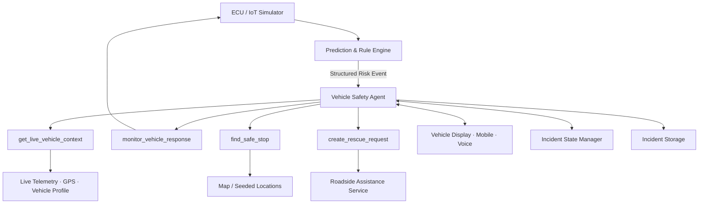
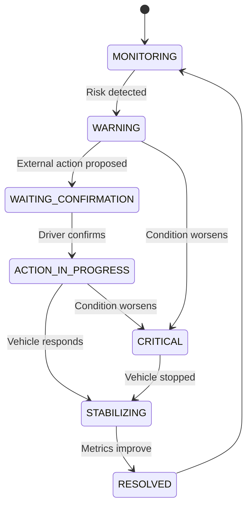
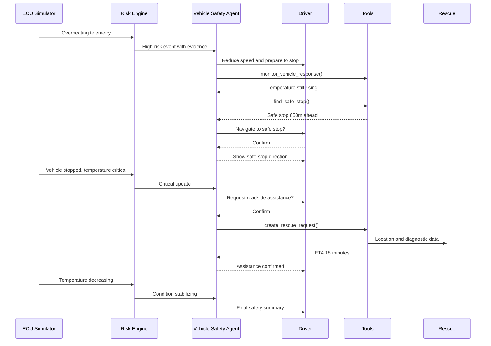

# Vehicle Safety Agent — Kiến trúc đề xuất

## 1. Mục tiêu

Vehicle Safety Agent là một agent hoạt động cùng chiếc xe, sử dụng dữ liệu ECU/IoT theo thời gian thực để:

- Nhận biết sự cố hoặc nguy cơ do Prediction & Rule Engine phát hiện.
- Hiểu trạng thái hiện tại của xe, hành trình và người lái.
- Đưa ra hướng dẫn an toàn, ngắn gọn và phù hợp với tình huống.
- Theo dõi phản ứng của xe sau khi người dùng thực hiện hướng dẫn.
- Điều chỉnh mức cảnh báo nếu tình trạng cải thiện hoặc trở nên nghiêm trọng hơn.
- Thực hiện các hành động đã được người dùng xác nhận, như tìm điểm dừng an toàn hoặc yêu cầu cứu hộ.
- Lưu lại sự cố để phục vụ theo dõi sức khỏe riêng của từng chiếc xe.

Giá trị cốt lõi của sản phẩm không phải là chatbot trả lời câu hỏi về ô tô. Agent chủ động xuất hiện đúng lúc nhờ context chỉ có bên trong xe: telemetry trực tiếp, trạng thái vận hành, vị trí và lịch sử của chính chiếc xe đó.

---

## 2. Nguyên tắc thiết kế cho MVP

Để phù hợp với thời gian hackathon, hệ thống chỉ sử dụng **một agent duy nhất**:

> **Vehicle Safety Agent = Orchestrator + Reasoning + User Interaction + Tool Calling**

Các phần còn lại là service, function hoặc tool thông thường, không triển khai thành các LLM agent riêng biệt.

Kiến trúc triển khai:

```text
1 Vehicle Safety Agent
+ 1 Prediction & Rule Engine
+ 4 core tools
+ 1 Incident State Manager
+ 1 Safety Policy Layer
+ 1 Incident Storage
```

Thiết kế này giảm số lượng prompt, API call, lỗi điều phối và thời gian debug nhưng vẫn thể hiện đầy đủ tính agentic.

---

## 3. Kiến trúc tổng thể



### Luồng tổng quát

```text
ECU/IoT telemetry
→ Prediction & Rule Engine phát hiện nguy cơ
→ Vehicle Safety Agent nhận Risk Event
→ Agent lấy context cần thiết
→ Agent đưa ra hướng dẫn
→ Agent theo dõi phản ứng của xe
→ Agent thay đổi kế hoạch nếu cần
→ Agent xin xác nhận trước hành động bên ngoài
→ Agent gọi tool
→ Agent lưu và kết thúc sự cố
```

---

## 4. Phân chia trách nhiệm

| Thành phần | Trách nhiệm |
|---|---|
| ECU/IoT Simulator | Phát dữ liệu xe bình thường và mô phỏng kịch bản sự cố |
| Prediction & Rule Engine | Phát hiện bất thường, tính severity, confidence và evidence |
| Vehicle Safety Agent | Hiểu context, chọn bước xử lý, giao tiếp và gọi tool |
| Incident State Manager | Lưu trạng thái của luồng sự cố và chống lặp hành động |
| Safety Policy Layer | Kiểm tra quyền hành động và yêu cầu xác nhận |
| Incident Storage | Lưu lịch sử sự cố, telemetry và kết quả xử lý |
| User Interface | Hiển thị cảnh báo, nhận phản hồi và hỗ trợ voice nếu có |

### Ranh giới giữa Prediction Engine và Agent

Prediction & Rule Engine chịu trách nhiệm xác định nguy cơ kỹ thuật. LLM không tự chẩn đoán xe trực tiếp từ telemetry thô.

Vehicle Safety Agent chịu trách nhiệm quyết định:

- Người dùng cần biết điều gì ngay lúc này.
- Hành động an toàn tiếp theo là gì.
- Có cần tiếp tục theo dõi hay nâng cấp cảnh báo không.
- Khi nào cần hỏi xác nhận.
- Tool nào cần được gọi.

---

## 5. Vehicle Safety Agent

### Nhiệm vụ

1. Nhận một `Risk Event` có cấu trúc.
2. Lấy context hiện tại của xe.
3. Giải thích rủi ro dựa trên evidence được cung cấp.
4. Đưa ra hướng dẫn phù hợp với severity và trạng thái xe.
5. Theo dõi phản ứng của xe sau hướng dẫn.
6. Nâng hoặc hạ cấp cảnh báo theo dữ liệu mới.
7. Hỏi người dùng trước khi thực hiện hành động bên ngoài.
8. Gọi tool sau khi được phép.
9. Lưu incident và tạo tóm tắt cuối cùng.

### Input mẫu

```json
{
  "incident_id": "INC-001",
  "event": "POSSIBLE_OVERHEATING",
  "severity": "HIGH",
  "confidence": 0.89,
  "vehicle_state": "MOVING",
  "telemetry": {
    "coolant_temperature": 108,
    "rpm": 3800,
    "engine_load": 84,
    "vehicle_speed": 65,
    "cooling_fan": "OFF"
  },
  "evidence": [
    "Coolant temperature increased 14°C in 4 minutes",
    "Engine load remained above 80%",
    "Cooling fan did not activate"
  ],
  "location": {
    "latitude": 16.047,
    "longitude": 108.206
  }
}
```

### Output mẫu

```json
{
  "message": "Nhiệt độ động cơ đang tăng nhanh. Hãy giảm tốc và chuẩn bị dừng xe tại vị trí an toàn.",
  "recommended_action": "REDUCE_SPEED_AND_MONITOR",
  "next_tool": "monitor_vehicle_response",
  "requires_confirmation": false,
  "incident_status": "WARNING"
}
```

---

## 6. Core tools

### 6.1. `get_live_vehicle_context()`

Lấy context cần thiết trước khi agent đưa ra quyết định.

**Dữ liệu đầu ra:**

- Telemetry mới nhất.
- Xu hướng telemetry trong khoảng thời gian gần nhất.
- Trạng thái xe: đang chạy, giảm tốc hoặc đã dừng.
- GPS và loại tuyến đường nếu có.
- Severity và confidence hiện tại.
- Số lần xảy ra tình trạng tương tự.

```json
{
  "vehicle_state": "MOVING",
  "road_context": "CITY_ROAD",
  "temperature_trend": "+4.5°C/min",
  "risk_trend": "WORSENING",
  "similar_incidents_last_90_days": 1
}
```

### 6.2. `monitor_vehicle_response()`

Đây là tool quan trọng nhất và là điểm khác biệt chính của agent. Sau khi đưa ra hướng dẫn, agent tiếp tục quan sát để kiểm tra:

- Người dùng đã giảm tốc hay chưa.
- RPM và tải động cơ có giảm không.
- Nhiệt độ có tiếp tục tăng không.
- Xe đã dừng an toàn chưa.
- Có cần nâng hoặc hạ severity không.

```json
{
  "incident_id": "INC-001",
  "monitor_duration_seconds": 30,
  "metrics": [
    "coolant_temperature",
    "rpm",
    "engine_load",
    "vehicle_speed"
  ]
}
```

Output:

```json
{
  "vehicle_speed_changed": "65 → 28 km/h",
  "rpm_changed": "3800 → 1900",
  "temperature_changed": "108 → 112°C",
  "condition": "WORSENING",
  "recommended_severity": "CRITICAL"
}
```

### 6.3. `find_safe_stop()`

Tìm nơi dừng an toàn phù hợp với vị trí và hướng di chuyển. Trong tình huống khẩn cấp, tool này quan trọng hơn tìm garage.

```json
{
  "current_location": {
    "latitude": 16.047,
    "longitude": 108.206
  },
  "vehicle_state": "MOVING",
  "maximum_distance_meters": 2000
}
```

Output:

```json
{
  "location_name": "Safe parking area",
  "distance_meters": 650,
  "estimated_time_minutes": 2,
  "safe_to_reach": true
}
```

Trong MVP, danh sách điểm dừng có thể được seed sẵn thay vì tích hợp bản đồ thật.

### 6.4. `create_rescue_request()`

Tạo yêu cầu cứu hộ kèm theo context kỹ thuật của xe.

```json
{
  "incident_id": "INC-001",
  "vehicle": "Demo Vehicle",
  "location": "16.047, 108.206",
  "incident": "Possible engine overheating",
  "severity": "CRITICAL",
  "vehicle_mobility": "STOPPED",
  "evidence": {
    "coolant_temperature": 114,
    "cooling_fan": "OFF",
    "dtc_codes": ["P0217"]
  }
}
```

Output mô phỏng:

```json
{
  "request_id": "RESCUE-1024",
  "status": "CONFIRMED",
  "estimated_arrival": "18 minutes"
}
```

Tool phải yêu cầu người dùng xác nhận trước khi tạo rescue request.

---

## 7. Incident State Manager

Không cần xây một state machine phức tạp. Backend chỉ cần quản lý các trạng thái sau:

```text
MONITORING
WARNING
WAITING_CONFIRMATION
ACTION_IN_PROGRESS
CRITICAL
STABILIZING
RESOLVED
```



State Manager giúp:

- Không gửi trùng cảnh báo.
- Không gọi tool nhiều lần.
- Ghi nhớ agent đang chờ xác nhận gì.
- Cho phép agent tiếp tục xử lý khi có telemetry mới.

---

## 8. Safety Policy

Safety Policy phải được triển khai bằng code hoặc rule cố định, không giao hoàn toàn cho LLM.

| Hành động | Chính sách |
|---|---|
| Đọc telemetry | Cho phép |
| Theo dõi phản ứng của xe | Cho phép |
| Hiển thị hướng dẫn an toàn | Cho phép |
| Tìm điểm dừng | Cho phép |
| Mở điều hướng | Yêu cầu xác nhận |
| Gọi cứu hộ | Yêu cầu xác nhận |
| Gửi vị trí hoặc dữ liệu xe | Yêu cầu xác nhận |
| Điều khiển trực tiếp phương tiện | Không cho phép trong MVP |

Rule mẫu:

```text
IF severity = CRITICAL AND vehicle_state = MOVING
THEN recommended_action = FIND_SAFE_STOP

IF external_action = CREATE_RESCUE_REQUEST
THEN require_user_confirmation = TRUE

IF driver_response_timeout AND severity = CRITICAL
THEN repeat_voice_warning = TRUE

IF requested_action = CONTROL_VEHICLE
THEN block_action = TRUE
```

---

## 9. Luồng demo Overheating



### Câu chuyện demo

1. Xe bắt đầu ở trạng thái bình thường.
2. Người demo kích hoạt `Inject Overheating`.
3. Risk Engine phát hiện bất thường đa tín hiệu.
4. Agent chủ động cảnh báo và nêu evidence ngắn gọn.
5. Agent yêu cầu tài xế giảm tốc.
6. Agent theo dõi nhưng nhận thấy nhiệt độ vẫn tăng.
7. Agent nâng cảnh báo lên Critical và tìm nơi dừng an toàn.
8. Sau khi xe dừng, agent xin phép tạo yêu cầu cứu hộ.
9. Rescue request nhận được vị trí và dữ liệu chẩn đoán.
10. Agent tiếp tục theo dõi cho đến khi nhiệt độ giảm và sự cố ổn định.

---

## 10. System prompt đề xuất

```text
You are a Vehicle Safety Agent operating alongside a vehicle.

Your responsibilities are to:
1. Interpret structured risk events produced by the vehicle risk engine.
2. Explain risks using only the evidence provided by the system.
3. Give short, safe and context-aware instructions based on severity and vehicle state.
4. Monitor how the vehicle responds after each recommendation.
5. Adapt the safety plan when the condition improves or worsens.
6. Ask for driver confirmation before performing any external action.
7. Use available tools only when required by the current incident state.
8. Continue monitoring until the incident becomes stable or resolved.

Safety constraints:
- Never claim a definite mechanical cause unless the risk engine confirms it.
- Never attempt to control the vehicle.
- Never provide dangerous repair instructions.
- Never call rescue services or share location without confirmation.
- When the vehicle is moving, keep messages short and action-oriented.
- Prioritize immediate driver safety over maintenance convenience.
```

---

## 11. Phạm vi MVP

### Bắt buộc

- Một kịch bản `Overheating`.
- Telemetry bình thường và telemetry tiêm lỗi.
- Risk Event có severity, confidence và evidence.
- Một Vehicle Safety Agent.
- Tool lấy context xe.
- Tool theo dõi phản ứng của xe.
- Tool tìm điểm dừng an toàn.
- Tool tạo rescue request mô phỏng.
- Xác nhận của người dùng trước hành động bên ngoài.
- Lưu incident và trạng thái xử lý.

### Có thể bổ sung nếu còn thời gian

- Voice output.
- Vehicle health report cho kỹ thuật viên.
- Đối chiếu baseline riêng của xe.
- So sánh sự cố với lịch sử.
- Bản đồ hoặc cứu hộ API thật.

### Không triển khai trong MVP

- Nhiều LLM agent độc lập.
- Nhiều loại lỗi xe.
- Booking garage thật.
- Vector database hoặc RAG.
- Điều khiển trực tiếp phương tiện.
- Authentication phức tạp.

---

## 12. Hướng phát triển

Mỗi chiếc xe có thể sở hữu một `Vehicle Digital Memory` gồm:

- Vehicle profile.
- Normal operating baseline.
- Driving patterns.
- Maintenance history.
- Previous incidents.
- Common routes.
- Preferred rescue provider.
- Driver safety preferences.

Điều này cho phép agent nhận ra rằng một chỉ số không chỉ bất thường so với ngưỡng chung mà còn bất thường so với chính lịch sử của chiếc xe.

Định hướng dài hạn:

> Agent không chỉ phát hiện chiếc xe đang có vấn đề. Nó hiểu đặc điểm riêng của xe, liên tục theo dõi phản ứng, điều chỉnh kế hoạch an toàn theo thời gian thực và phối hợp hỗ trợ bằng context kỹ thuật mà chỉ một agent sống cùng chiếc xe mới có thể tiếp cận.

---

## 13. Thông điệp pitching

> **Vehicle Safety Agent is an AI safety companion that lives with the car. It turns real-time vehicle telemetry into context-aware decisions, monitors how the vehicle responds, adapts its safety plan, and coordinates assistance using diagnostic context that only an agent inside the car can access.**

